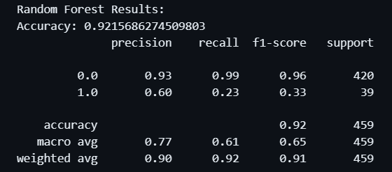
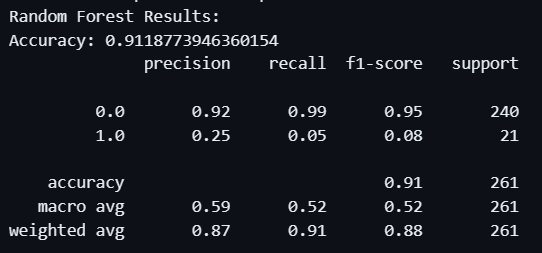
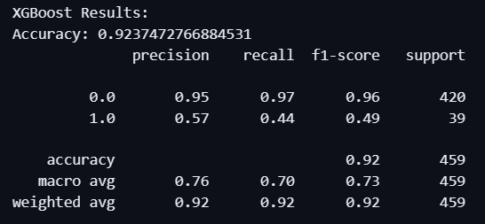
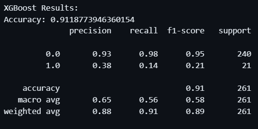
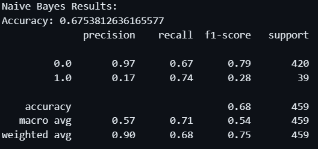
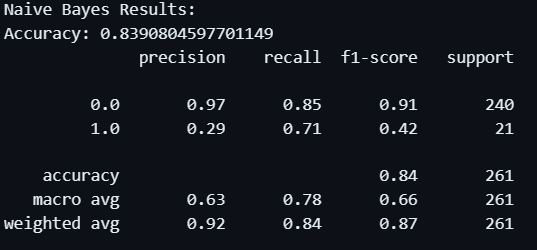
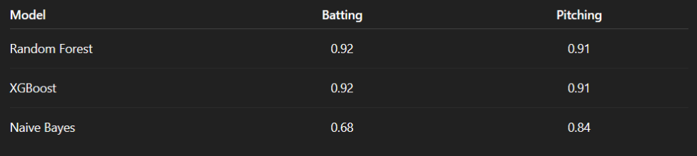

## Abstract & Motivation

- Hall of Fame selection is one of the most prestigious yet subjective honors in Major League Baseball.

### Project Goal
- Build a machine learning model to predict Hall of Fame induction using career-level statistics and achievements.

### Data Source
- **Lahman Baseball Database** — player records spanning 100+ years

---

## Approach

- Data cleaning & feature engineering  
- Model training with classification algorithms  

**Outcome**
- Evaluate prediction accuracy  
- Identify key career metrics that influence Hall of Fame voting outcomes  

---

## Exploratory Data Analysis

- Visualized metric distributions and adjusted data for modeling  
- Built correlation matrices to guide feature engineering  
- Split models:  
  - Pitchers (ERA, Wins, Strikeouts)  
  - Position Players (AVG, HR, Hits)  

**Feature Engineering**
- Batting Avg, Slugging %, On-Base %  
- WHIP, K/BB  

---

## Modeling Approach

- Random Forest → interpretable, feature importance  
- XGBoost → handles complex nonlinear patterns  
- GaussianNB → simple baseline model  

**Hyperparameter Tuning**
- RandomizedSearchCV  

**Preparation**
- Train/test split  
- Scaling + PCA experiments  

---

## Modeling Evaluation

**Metrics Used**
- Accuracy → overall correctness  
- Precision & Recall → false positives/negatives  
- F1 Score → balance of precision & recall  
- ROC-AUC → separation of inducted vs. non-inducted  

---

## Random Forest Results

---

## XGBoost Results

---

## Naive Bayes Results

---

## Model Accuracy Results

---

## Conclusion

- Career stats can predict Hall of Fame induction with high accuracy  
- Models capture patterns but miss subjective factors (awards, reputation, historical context)  
- Next steps: add advanced metrics & era adjustments for better accuracy  
- Data analytics offers valuable insight into what drives Hall of Fame voting  
